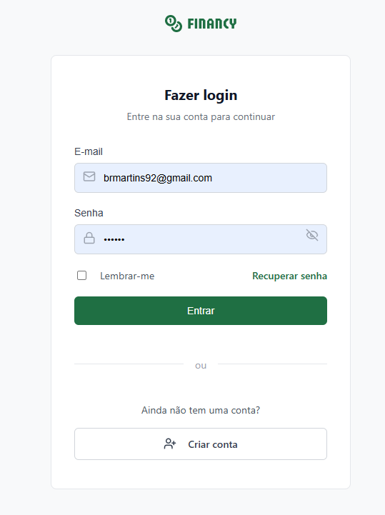
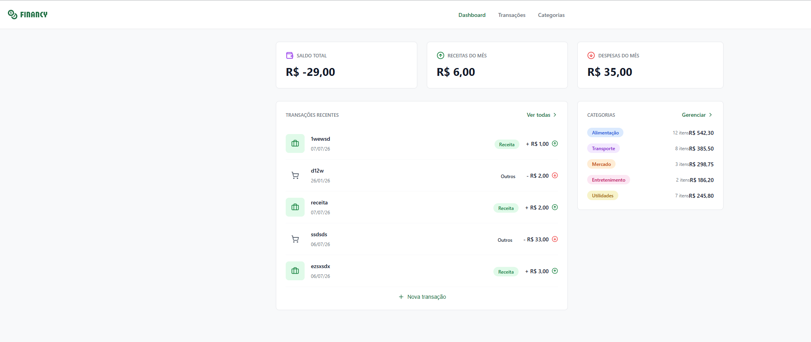
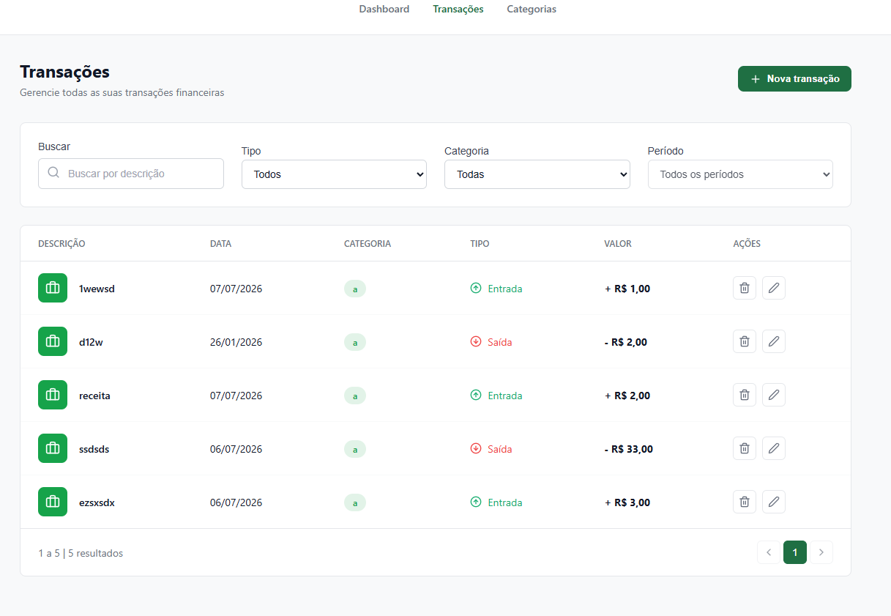

<div align="center">
  
</div>

<br/>

<div align="center">
  <strong>O seu controle financeiro completo, intuitivo e inteligente.</strong>
</div>

<p align="center">
  Um sistema fullstack construído com as melhores práticas de mercado para gerenciar receitas, despesas e acompanhar a saúde financeira do seu dia a dia.
</p>

<p align="center">
  <a href="#sobre-o-projeto">Sobre</a> •
  <a href="#funcionalidades">Funcionalidades</a> •
  <a href="#tecnologias-utilizadas">Tecnologias</a> •
  <a href="#arquitetura--organização">Arquitetura</a> •
  <a href="#como-executar">Como Executar</a> •
  <a href="#aprendizados">Aprendizados</a> •
  <a href="#contato">Contato</a>
</p>

---

## 💻 Sobre o projeto

O **Financy** é uma aplicação completa de gestão financeira pessoal que resolve o problema de acompanhamento de fluxo de caixa diário. Com ele, o usuário consegue visualizar o saldo, entradas e saídas do mês, além de cadastrar categorias e gerenciar cada transação detalhadamente.

Este projeto foi desenvolvido de ponta a ponta como parte da **Pós-Graduação em Desenvolvimento Fullstack da Rocketseat**, colocando em prática conceitos avançados de arquitetura de software, Clean Architecture, Design Patterns e desenvolvimento ágil focado na experiência do usuário (UX).

Trata-se de um portfólio sólido que demonstra domínio completo sobre o ciclo de vida de uma aplicação **Fullstack**, integrando um frontend robusto e responsivo com um backend seguro e otimizado via GraphQL.

---

## ✨ Funcionalidades

- **Autenticação:** Cadastro e Login seguros com JWT.
- **Dashboard:** Resumo visual com Saldo Total, Entradas e Saídas do mês atual.
- **Gestão de Transações:** 
  - Criação de receitas (INCOME) e despesas (EXPENSE).
  - Filtros dinâmicos e em tempo real por descrição, tipo (Entrada/Saída) e categoria.
  - Paginação inteligente atrelada aos filtros de busca no lado do cliente.
- **Gestão de Categorias:** Criação de categorias personalizadas com ícones e cores para organização visual do seu fluxo.
- **Feedback Visual Avançado:** Componentização rica de alertas (AlertModal) para tratamento amigável de erros de validação em português.

---

## 🛠 Tecnologias Utilizadas

O projeto foi estruturado em dois ecossistemas principais, interligados através de uma API GraphQL fortemente tipada.

### 🌐 Frontend
- **React.js** com **TypeScript**
- **Vite** (Bundler e Dev Server otimizado e veloz)
- **React Router DOM** (Roteamento client-side SPA)
- **TanStack React Query** (Gerenciamento inteligente de cache, invalidation state e dados assíncronos)
- **GraphQL Request** (Client leve e flexível para consumo da API GraphQL)
- **Lucide React** (Ícones modernos, consistentes e escaláveis)
- **Vanilla CSS** (Estilização pura fundamentada em um Design System proprietário focado em tokens de usabilidade)

### ⚙️ Backend
- **Node.js** com **TypeScript**
- **GraphQL** (Type-safe API e ecossistema flexível de Resolvers)
- **Prisma ORM** (Modelagem declarativa de dados e controle seguro de migrações)
- **SQLite** (Banco de dados de desenvolvimento leve e embarcado)
- **Zod** (Validação implacável de schemas e fluxos de entrada)
- **Vitest** (Suíte veloz para Testes Unitários e de Integração)

---

## 🏗 Arquitetura / Organização

### Backend
O backend foi arquitetado inspirando-se profundamente na **Clean Architecture / Hexagonal Architecture**, garantindo altíssimo nível de desacoplamento:
- **Domain:** Entidades puras (ex: `Transaction`, `Category`, `User`) e erros customizados (`AppError`).
- **Application (Casos de Uso):** Onde a mágica acontece. A lógica de negócio pura, isolada de bancos e frameworks externos.
- **Infrastructure:** Implementações concretas que conversam com o mundo real (ex: `PrismaTransactionRepository`), lidando com as transações no banco e Injeção de Dependências (`container.ts`).
- **GraphQL Layer:** A camada de apresentação (Schemas e Resolvers) que consome os casos de uso autenticados, mantendo-se ignorante sobre a regra de negócios.

### Frontend
O ecossistema frontend adota o padrão **Feature-Sliced Design (Feature Folders)**. Cada parte vital do sistema (`auth`, `category`, `transactions`, `dashboard`) empacota os próprios componentes, hooks, views, serviços e tipos.
- A comunicação com o Backend é centralizada em um `graphqlClient` seguro (JWT). 
- A responsabilidade pesada de revalidação e cache (`invalidateQueries`) é perfeitamente orquestrada pelo **React Query**, garantindo UI consistente sem malabarismos com estado global verboso.

---

## 🚀 Como executar o projeto

### Pré-requisitos
Antes de decolar, certifique-se de ter em sua máquina o [Node.js](https://nodejs.org/en/) (recomendado LTS) e um gerenciador de pacotes eficiente, como [Yarn](https://yarnpkg.com/) ou NPM.

### 1. Clonando o Repositório
```bash
git clone https://github.com/[seu-usuario]/financy-pos-graduacao.git
cd financy-pos-graduacao
```

### 2. Rodando o Backend (API)
Abra o primeiro terminal:
```bash
# Entre na pasta do backend
cd backend

# Instale as dependências
yarn install

# Execute as migrações para criar e rodar as tabelas no seu banco local SQLite
yarn prisma migrate dev

# Dê o start no servidor de desenvolvimento
yarn dev
```
O servidor GraphQL passará a ouvir requisições na porta: `http://localhost:4000/graphql`

### 3. Rodando o Frontend (Aplicação Web)
Abra um **novo terminal** em paralelo:
```bash
# Vá para a raiz do repositório e entre no frontend
cd frontend

# Instale os pacotes e dependências
yarn install

# Inicie o Vite dev server
yarn dev
```
A mágica ganha vida em: `http://localhost:5173/` (Vite Default)

---

## 📂 Estrutura de Pastas Resumida

```text
financy-pos-graduacao/
├── backend/
│   ├── prisma/             # Schema declarativo do banco de dados e Histórico de Migrations
│   └── src/
│       ├── application/    # Regras de Negócio Invariáveis e Use Cases
│       ├── domain/         # Entidades de Domínio e Tratamento de Erros
│       ├── graphql/        # Schemas TypeDefs, Resolvers e Context Auth
│       ├── infrastructure/ # Repositórios concretos do Prisma ORM
│       └── tests/          # Testes Unitários e Testes de Integração
└── frontend/
    └── src/
        ├── app/            # Roteador (React Router) e Providers de App
        ├── features/       # Módulos Independentes (auth, category, dashboard, transactions, etc)
        ├── generated/      # Tipos tipados dinamicamente do GraphQL Backend
        ├── pages/          # Aggregators Views de Página
        ├── services/       # Clients autênticados para requisições externas
        └── shared/         # Componentes Reutilizáveis de UI (Inputs, Alerts, Botões, Layout)
```

---

## 📸 Demonstração do Projeto

> [Adicionar screenshot da Tela de Login]

> [Adicionar screenshot do Dashboard Inicial com os Cards]

> [Adicionar screenshot da Tela de Transações filtradas]

*(Nota: Adicione as screenshots do projeto aqui depois que tirar elas!)*

---

## 🧠 Aprendizados e Evolução

Construir o **Financy** representou um salto qualitativo colossal na minha forma de desenhar software profissionalmente.
Neste projeto, alcancei vitórias técnicas marcantes:
- **Design de Arquitetura Sólido:** Entendi e apliquei, na prática, os benefícios reais da Clean Architecture e Inversão de Dependências.
- **Gerenciamento de Estado Escalável:** Aprendi que orquestrar atualizações em tempo real no React não precisa doer graças à revalidação imperativa orientada por cache usando **React Query**.
- **Segurança e Rigor (Zod):** Blindei minha aplicação ponta-a-ponta contra fluxos de dados sujos, retornando erros limpos que a interface consegue absorver e exibir amigavelmente para o usuário.
- **Qualidade de Testes Ágeis:** Solidifiquei o Test Driven Development testando Use Cases complexos usando Fakes Repositories em memória, e consolidando a qualidade com testes reais de integração via Vitest.

---

## 🚀 Conclusão

O **Financy** vai além de um simples registro de despesas. Ele é a evidência palpável da minha proficiência técnica adquirida na pós-graduação e no desenvolvimento real. É um sistema onde o backend escala e não se confunde, enquanto o frontend entrega fluidez, velocidade e boa estética ao usuário final.

---

## ✉️ Contato / Autor

**[Bruno dos Santos Martins]**  
Desenvolvedor Fullstack


